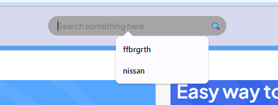

# Rent-a-Car-Project
Group project for a car rental website.

Our goal is to create a basic web application to manage car rentals, allowing users to view available cars, rent them, and see rental details.

We'll use JavaScript arrays of objects to represent our data.

The main page will display all available cars of our rental service. Also our group will also add a filter function to render a easier search function. And lastly, we will add a calculator to identify the cost of each car for rent.

# Rent-a-Car Group Project

---

⭐ **Star us on GitHub** — your support motivates us a lot! 🙏 😊

---

## 🔗 Table of Contents
- [About the Project](#about-the-project)
- [Preview](#preview)
- [Project Structure](#project-structure)
- [Technologies Used](#technologies-used)
- [Team Members](#team-members)

---

## 🚀 About the Project

Launched as a group project, **Rent-a-Car** is a fully responsive, user-friendly car rental website. The goal is to provide users with an intuitive interface to browse, search, and save favorite cars for rent.

The platform includes multiple interactive pages, from viewing car details to managing a personal wishlist.

## 🎥 Project Demo Video

Here is a short demo video of our **Rent a Car Project** showing the main features and functionality.  
Click the link below to watch:

[▶️ Watch the Project Demo Video](https://youtu.be/nFloporpuIg)

---

## 🖼️ Preview

  
*Homepage - clean design and car listings*

  
*Car Detail Page - in-depth info for each vehicle*

  
*Wishlist - save your favorite cars*

  
*Vehicle Grid Layout*

  
*Additional UI Elements*

---

## 📁 Project Structure

# Rent-a-Car Group Project

This is our **Rent-a-Car** group project. It includes all necessary files for the website.

## Project Structure

- **assets/** – Contains images and other media files.  
- **images/** – Additional image resources.  
- **README.md** – Project documentation.  
- **detail.html** – Detail page for a specific car.  
- **index.html** – Main landing page of the website.  
- **script.js** – Main JavaScript functionality for the site.  
- **style.css** – Website styling.  
- **wishlist.html** – Wishlist page for saved cars.  
- **wishlist.js** – JavaScript functionality for the wishlist page.  

## Preview

### You can choose Pick up or Drop off by checkbox.

### The Search box is working. You can sort any kind of car's model.

### To sort -  You have to write a car's model in the box.

### If you loged in, You can see you name on the right up.

### But You have log in or register to choose your rent a car. And then you can choose a car.

---

## Team Members:  
Milana Rzazada
Demar Payne

## Technologies Used:  
-*HTML*
-*CSS*
-*JavaScript*

